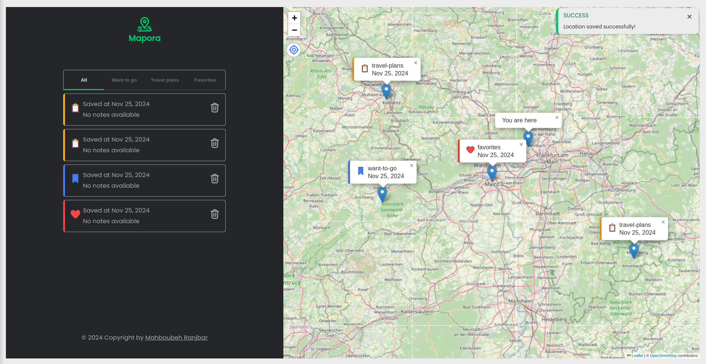
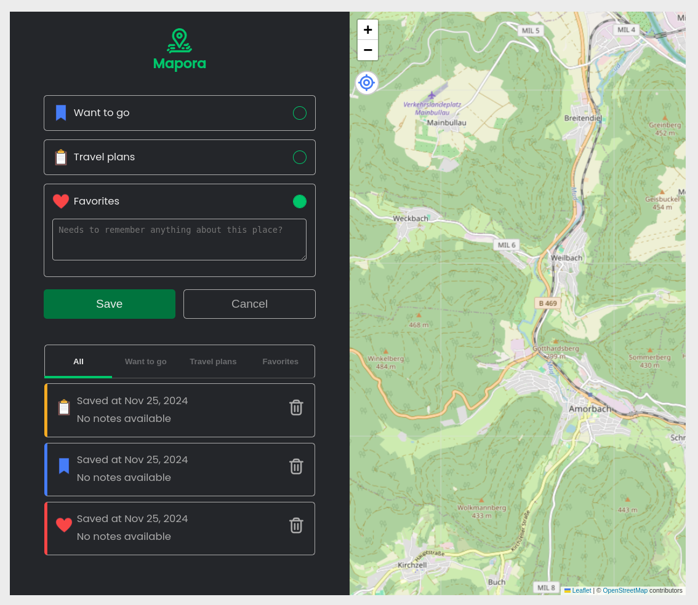
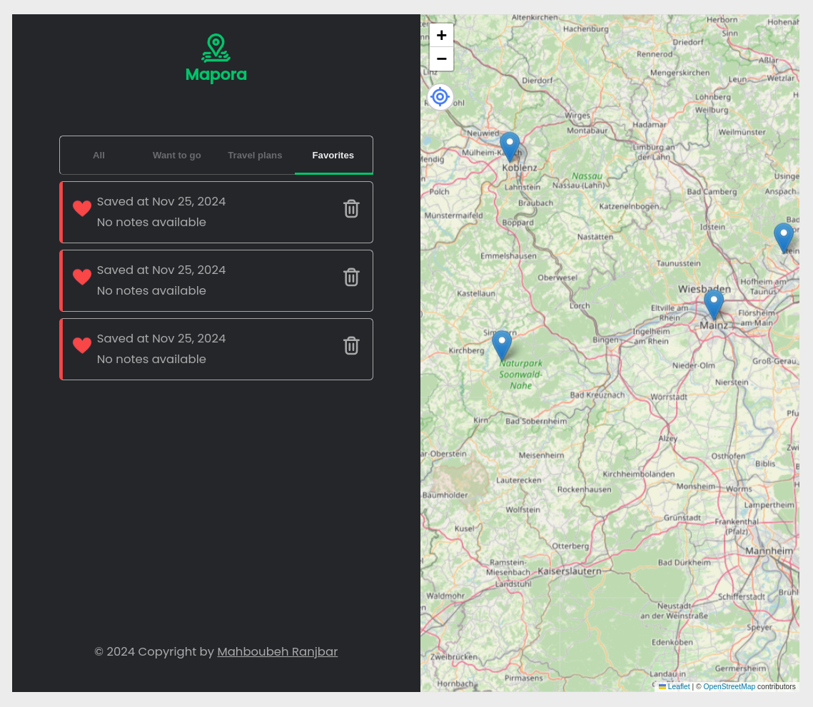

## Mapora - Location Bookmarking App

Mapora is a map-based location management application that enables users to save their favorite locations, add notes, and categorize them under different types such as "Want to go," "Travel plans," and "Favorites." Users can interact with a map to add, view, and delete saved locations. The app features a modern, responsive UI, making it accessible on various screen sizes.

## App-Screenshot

Here's a look at the application in action:


### Screenshots

- **Desktop View**




- **Mobile View**
[mobile-view-1](./images/screenshots/mobile-view-1.png)
[mobile-view-2](./images/screenshots/mobile-view-1.png)

### Features

- **Map Interaction:**
    - Add locations directly by clicking on the map.
    - Save locations with notes and categorize them.
    - View all saved locations and navigate to them.

- **Responsive UI:**
    - Designed for both desktop and mobile screens.
    - Sidebar adjusts dynamically based on the screen size.

- **Location Management:**
    - Filter saved locations by category using tabs.
    - Delete saved locations from the map and tabs dynamically.

- **Locate Me Button:**
    - Center the map on the user's current location with a single click.


### Technologies Used

- **Frontend:**
    - HTML, CSS (responsive design with media queries).

- **JavaScript:**
    - Core functionality and event handling.
    - DOM manipulation for a dynamic user interface.

- **Libraries:**
    - **Leaflet.js** for map rendering and interaction.  
        - **Documentation:** [Leaflet Official Documentation](https://leafletjs.com/download.html)  
        - **Installation:**  
          1. **CDN Installation:** Add the following lines to your `<head>` section in your HTML file:
             ```html
             <link rel="stylesheet" href="https://unpkg.com/leaflet@1.9.4/dist/leaflet.css" integrity="sha256-xwE8rjbIuKeRzUVsoWqZmucw9pIXt9Aw5XQQBsmtwH0=" crossorigin="" />
             <script src="https://unpkg.com/leaflet@1.9.4/dist/leaflet.js" integrity="sha256-XQoYMqMTKnB1K4/YmgBxHu5Nht/6vltM01A3bsZxj6w=" crossorigin=""></script>
             ```
          2. **NPM Installation:** Install Leaflet using npm for better integration in modular projects:
             ```bash
             npm install leaflet
             ```
             Then import it in your JavaScript:
             ```javascript
             import L from 'leaflet';
             ```

        ```


### Screenshots

- **Desktop View**
[desktop-view-1](./images/desktop-view-1)
[desktop-view-2](./images/desktop-view-2)

- **Mobile View**
[mobile-view-1](./images/mobile-view-1)
[mobile-view-2](./images/mobile-view-1)

## Setup and Usage
1- Clone the repository:

```bash
git clone git@github.com:
```
2- Open index.html in your browser to view the website.


## License
This project is licensed under the [MIT License](./LICENSE).  
You are free to use, modify, and distribute this project as long as proper credit is given to the original author.


### Credits
- Inspiration:
This project was inspired by a feature demonstrated in a [The Complete JavaScript Course 2024 on Udemy](https://www.udemy.com/share/101Wfe3@KaX6tJ_yBgkzGF-iJpzu9t2ZlAyqLQfe4H8HwRk-biJIKZksUl3xY8xvKJ2O-fRF_A==/). In the course, the trainer used the map functionality to display running and cycling locations. I reimagined this concept and created a unique application focused on saving favorite locations with added customizations, showcasing my own skills.

- Author
Feel free to connect with me for feedback, suggestions, or collaboration opportunities.

- **LinkedIn**: [My LinkedIn Profile](https://linkedin.com/in/mahboubeh-ranjbar-944132239)  
- **GitHub**: [My GitHub Profile](https://github.com/mahboube89)  

If you find this project helpful, don’t forget to give it a ⭐ on GitHub!